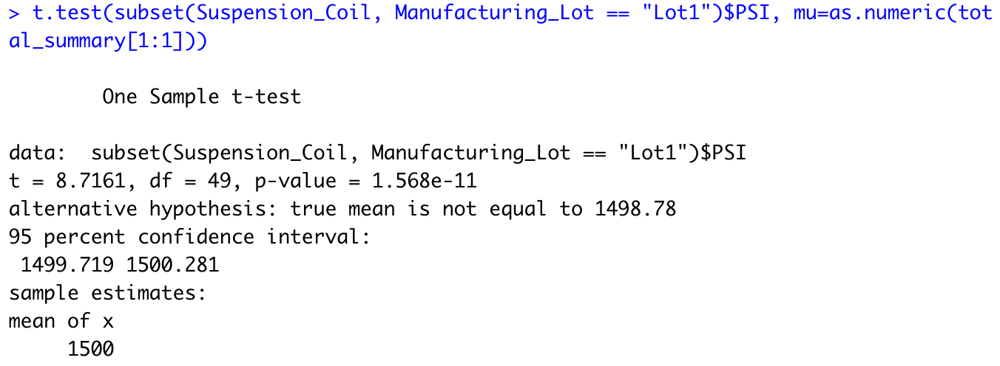
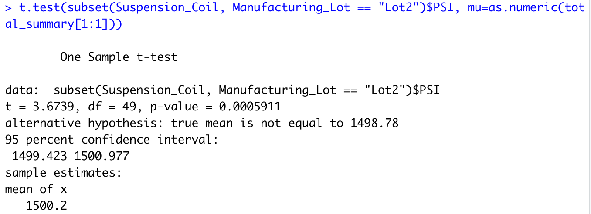
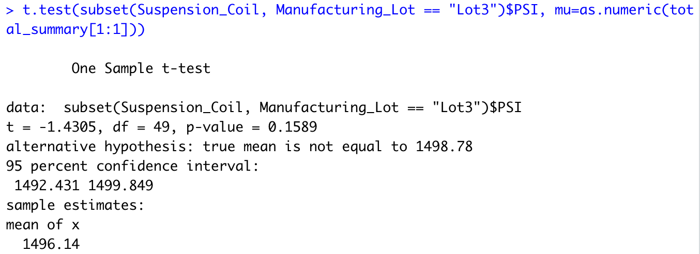

# MechaCar_Statistical_Analysis

## Linear Regression to Predict MPG

According to our results, vehicle length and ground clearance (as well as intercept) are statistically unlikely to provide random amounts of variance to the linear model. In other words, they have a significant impact on MPG. 

When an intercept is statistically significant, it means there are other variables that we have not accounted for that contribute to variance of MPG. 

Our P-Value is 5.35e-11, which is much smaller than our assumed significant level of .05%. Therefore, we can stat there is sufficient evidence to reject our null hypothesis ,which means our slope of our linear model is not zero. 

R-sqaared is .7149, which means that roughly 72% of MPG predicition will be correct using this linear model. 

## Summary Statistics on Suspension Coils 

We wanted to deetermine if the weight capacties from suspension coils in the manufacturing process is consistsent across production lots. From our analysis we determine that across all lots we have a mean of ~1498 PSI, median of 1500 PSI, with Standard Deviatoin of ~7.9. 

When we look at the data from all lots, we meet the standards of not exceeding a variance of 100 pounds per square inch on the coils. 

But once we cut the data by their seperate Lots we can call out that Lot3 holds much of the blame in our inconsistencies. 

We see that that the SD of Lot3 is 13 off the mean versus just 2.7 from Lot2 and .99 from Lot1. 

## T-Tests on Suspension Coils

### T-test for all lots 

Assuming the significance level of .05%, our p-value of 1 is above the significance level. Therefore, we do not have sufficient evidence to reject the null hypothesis. 

### T-test for Lot 1

Assuming significnace level of .05%, our p-value for Lot 1 of 1.568e-11 is lower than the significance level. Therefore, we do not have sufficient evidence to reject the null hypothesis. 

### T-test for Lot 2

Assuming significance level of .05%, our p-value for Lot 2 

### T-test for Lot 3

